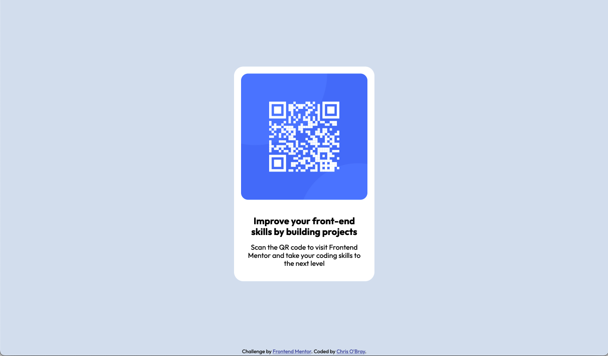
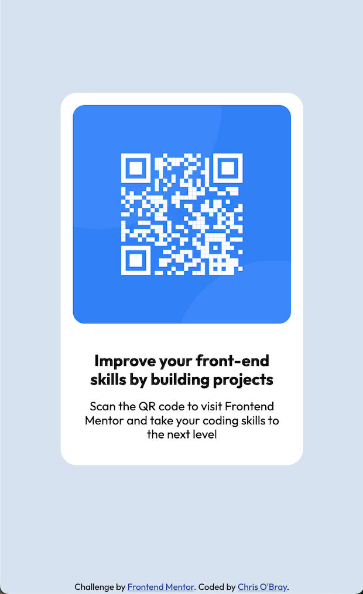

## Table of contents

- [Overview](#overview)
  - [Screenshots](#screenshots)
  - [Links](#links)
- [My process](#my-process)
  - [Built with](#built-with)
- [Author](#author)

## Overview

This was such a nice little project, courtesy of [Frontend Mentor](https://www.frontendmentor.io)!
I've been knee-deep in learning React that it was nice to go back and code something with pure HTML and CSS. I usually use SASS, but went with plain ol' CSS for this wee project. I went with a mobile-first design (something I do not do enough), and surprisingly... it all just worked out fine in desktop-land as well.

### Screenshots

Desktop:

### Links

- Solution URL: [https://github.com/nobrayn/FEM-QR-code-component](https://github.com/nobrayn/FEM-QR-code-component)
- Live Site URL: [https://nobrayn-fem-qr-code-component.netlify.app/](https://nobrayn-fem-qr-code-component.netlify.app/)

## My process

Step by step? Let's do this:
- Created a new project folder for the provided starter files.
- Initialized a git repository, pushed an initial commit to GitHub.
- Reviewed documentation and assets provided
- Decided on "vanilla" CSS (and not SASS) for this project
- Retrieved font information from Google Font Library
- Created HTML markup
- Worked top to bottom with CSS
- Tested both desktop and mobile views
- Pushed another commit to GitHub
- Went live via Netlify
- Edited this readme file!

### Built with

- Semantic HTML5 markup
- CSS custom properties
- Flexbox
- Mobile-first workflow

## Author

- Website - [Chris O'Bray (aka nobrayn)](https://www.nobrayn.com)
- Frontend Mentor - [@nobrayn](https://www.frontendmentor.io/profile/nobrayn)
- omg.lol (more links!) [nobrayn](https://nobrayn.omg.lol)
